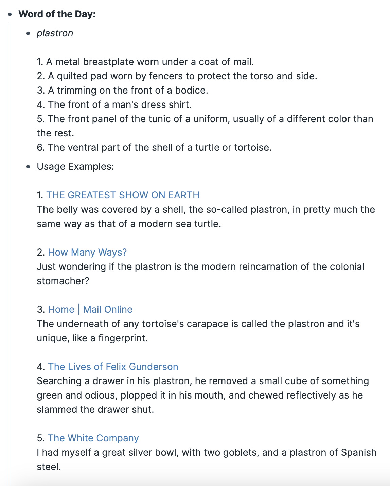

Expand your vocabulary by importing a Word of the Day with its definition to your graph.

**Update:**
The APIs used for this extension previously appear to be broken. The extension is now updated to use a new API, for which you will need a new API key.

The new API only imports one word. You can trigger it using Command Palette 'Word of the Day' or SmartBlock <%WOTD%>. You can also decide whether to import usage examples to display below the word definition.

Please get an API key from https://www.wordnik.com/.

